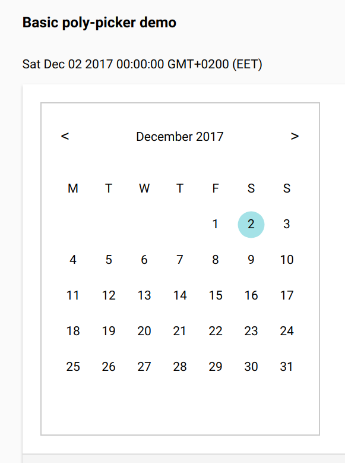

# \<poly-picker\>

Date picker built with Polymer

## Desc

A small exploration project with a purpose of building a date picker with Polymer. I didn't have any prior knowledge of Polymer. Styling is done and the parent component is able to listen to date change. The selection indication with CSS is buggy as I'm not familiar with how to work with the change detection here. Maybe I'll fix it some time.

## License

MIT
